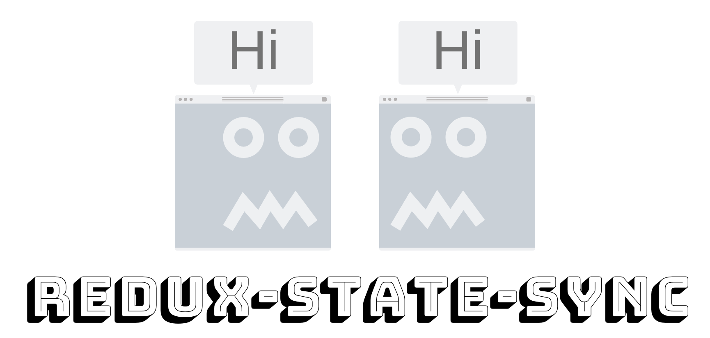
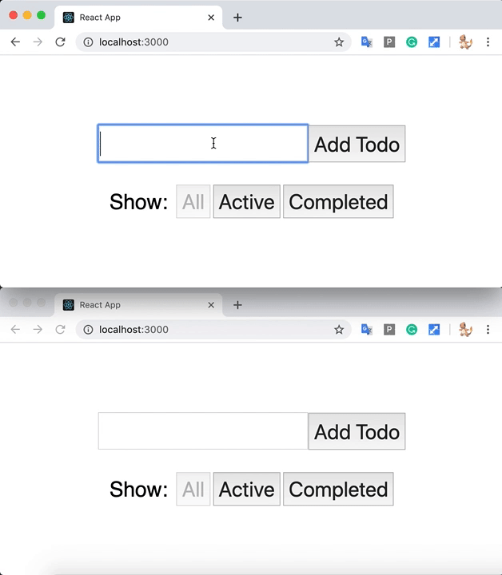

<p align="center">
  <a href="https://github.com/AOHUA/redux-state-sync">
    
  </a>
</p>

# Redux-State-Sync 3

A lightweight middleware to sync your redux state across browser tabs. It will listen to the Broadcast Channel and dispatch exactly the same actions dispatched in other tabs to keep the redux state in sync.

[](https://travis-ci.org/AOHUA/redux-state-sync)
[](https://www.npmjs.com/package/redux-state-sync)

### Why Redux-State-Sync?



It syncs your redux store across tabs with very minimal configuration.

Thanks to [BroadcastChannel](https://developer.mozilla.org/en-US/docs/Web/API/Broadcast_Channel_API), we now have a more efficient way to communicate between tabs instead of using any type of local storage. However, Not all the browsers support BroadcastChannel API for now. So I used [pubkey's BroadcastChannel](https://github.com/pubkey/broadcast-channel) to find the best way to communicate between tabs for redux-state-sync. [pubkey's BroadcastChannel](https://github.com/pubkey/broadcast-channel) will make sure that the communication between tabs always works.

### How to install

Install with npm.

```
npm install --save redux-state-sync
```

Install with yarn

```
yarn add redux-state-sync
```

### TypeScript support

Install with npm.

```
npm install --save-dev @types/redux-state-sync
```

Install with yarn

```
yarn add --dev @types/redux-state-sync
```

Types are defined [here](https://github.com/DefinitelyTyped/DefinitelyTyped/blob/e6e55443f88128b6393105407c8e8239cb10509b/types/redux-state-sync/index.d.ts)

### Before you use

Please take note that BroadcastChannel can only send data that is supported by the [structured clone algorithm](https://developer.mozilla.org/en-US/docs/Web/API/Web_Workers_API/Structured_clone_algorithm) (Strings, Objects, Arrays, Blobs, ArrayBuffer, Map), so you need to make sure that the actions that you wanna send to other tabs doesn't include any functions in the payload.

If you are using redux-persist, you may need to blacklist some of the actions that is triggered by redux-persist. e.g. persist/PERSIST, persist/REHYDRATE, etc.

### How to use

Create the state sync middleware with config:

```javascript
import { createStore, applyMiddleware } from 'redux';
import { createStateSyncMiddleware, initMessageListener } from 'redux-state-sync';

const config = {
    // TOGGLE_TODO will not be triggered in other tabs
    blacklist: ['TOGGLE_TODO'],
};
const middlewares = [createStateSyncMiddleware(config)];
const store = createStore(rootReducer, {}, applyMiddleware(...middlewares));
// this is used to pass store.dispatch to the message listener
initMessageListener(store);
```

##### initMessageListener is a new function to fix the bug that if the other tab not triggering any action on first load, it cannot receive any messages.

Init new tabs with existing state:

1. Use initStateWithPrevTab to get existing state from other tabs

```javascript
import { createStore, applyMiddleware } from 'redux';
import { createStateSyncMiddleware, initStateWithPrevTab } from 'redux-state-sync';

const config = {
    // TOGGLE_TODO will not be triggered in other tabs
    blacklist: ['TOGGLE_TODO'],
};
const middlewares = [createStateSyncMiddleware(config)];
const store = createStore(rootReducer, {}, applyMiddleware(...middlewares));
// init state with other tabs
initStateWithPrevTab(store);
// initMessageListener(store);
```

##### Note: if you are already using initStateWithPrevTab, you don't need to initMessageListener anymore.

2. Wrap your root reducer with `withReduxStateSync`

```javascript
import { withReduxStateSync } from 'redux-state-sync';
const rootReducer = combineReducers({
    todos,
    visibilityFilter,
});

export default withReduxStateSync(rootReducer);
```

##### Note: ignore this if you are using `redux-persist`, because you will always inite your app with the state in the storage. However, if you don't want to persist the state in the storage and still want to init new tabs with opening tabs' state, you can follow the example above.

### Config

#### channel

Unique name for Broadcast Channel

type: `String`

default: "redux_state_sync"

```javascript
const config = {
    channel: 'my_broadcast_channel',
};
const middlewares = [createStateSyncMiddleware(config)];
```

#### predicate

A function to let you filter the actions as you wanted.

##### Note: Since version 3.0 the function receives the action itself and not only the action type.

type: `Function`

default: null

```javascript
const config = {
    // All actions will be triggered in other tabs except 'TOGGLE_TODO'
    predicate: action => action.type !== 'TOGGLE_TODO',
};
const middlewares = [createStateSyncMiddleware(config)];
```

#### blacklist

A list of action types that you don't want to be triggered in other tabs.

type: `ArrayOf(<String>)`

default: []

```javascript
const config = {
    // All actions will be triggered in other tabs except 'TOGGLE_TODO'
    blacklist: ['TOGGLE_TODO'],
};
const middlewares = [createStateSyncMiddleware(config)];
```

#### whitelist

Only actions in this list will be triggered in other tabs.

type: `ArrayOf(<String>)`

default: []

```javascript
const config = {
    // Only 'TOGGLE_TODO' will be triggered in other tabs
    whitelist: ['TOGGLE_TODO'],
};
const middlewares = [createStateSyncMiddleware(config)];
```

##### Warning: You should only use one of the option to filter your actions. if you have all 3 options predicate, blacklist, and whitelist, only one will be effective and the priority is predicate > blacklist > whitelist.

#### broadcastChannelOption

Redux-state-sync is using [BroadcastChannel](https://github.com/pubkey/broadcast-channel) to comunicate between tabs. broadcastChannelOption is the option passed to broadcastChannel when we creating the channel.

type: `Object`

default: null

```javascript
const config = {
    // Only 'TOGGLE_TODO' will be triggered in other tabs
    whitelist: ['TOGGLE_TODO'],
    // enforce a type, oneOf['native', 'idb', 'localstorage', 'node']
    broadcastChannelOption: { type: 'localstorage' },
};
const middlewares = [createStateSyncMiddleware(config)];
```

### Working with immutable.js

Please check the example_immutable folder.

#### prepareState

Prepare the initial state for sending to other tabs.

type: `Function`

default: state => state

```javascript
const config = {
    // Map immutable object to js
    prepareState: state => state.toJS(),
};
const middlewares = [createStateSyncMiddleware(config)];
```

```javascript
import { combineReducers } from 'redux-immutable';
import { withReduxStateSync } from 'redux-state-sync';
const rootReducer = combineReducers({
    todos,
    visibilityFilter,
});

export default withReduxStateSync(appReducer, state => Immutable.fromJS(state));
```
